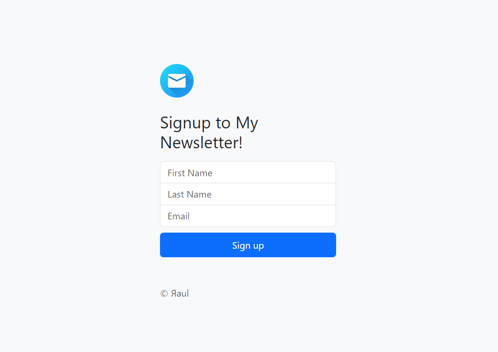

# Newsletter Signup

A web app project using **Mailchimp API** and **Firebase Hosting**.
*This is an open-source **sample app** for learning purposes only.*
[Website link](https://newsletter-signup-fef5c.web.app/)

If you want to test the app on your local machine before deploy, follow the steps below:

1. In 'app.js' file:
- uncomment this line: 
`22 //app.use(express.static(__dirname));`
- add '**/public**' in file path in these lines of code:
`27 res.sendFile(path.join(__dirname, '/public/index.html'));`
`60 res.sendFile(path.join(__dirname, '/public/success.html'));`
`62 res.sendFile(path.join(__dirname, '/public/failure.html'));`

2. In 'index.html' file:
- add '**/public**' in file path in these lines of code:
`112 <link href="/public/css/styles.css" rel="stylesheet">` 
`118 `

3. Now you can start the server with 'node app.js' or 'nodemon app.js' command and test your app on browser typing 'localhost:3000'.

*Don't forget to undo all steps above if you want to deploy your app using Firebase Hosting, it's necessary because firebase hosting has already the package 'public' as default for frontend static files.*

*Hope you enjoy it* 🙃      
*Feel free to open an issue and contribute with the project* ❤️   